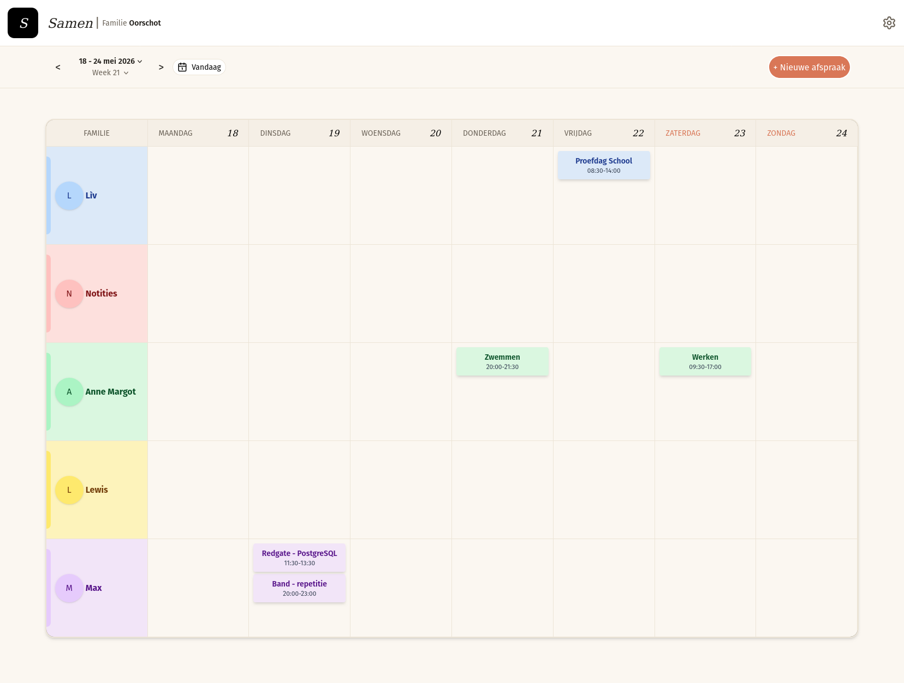
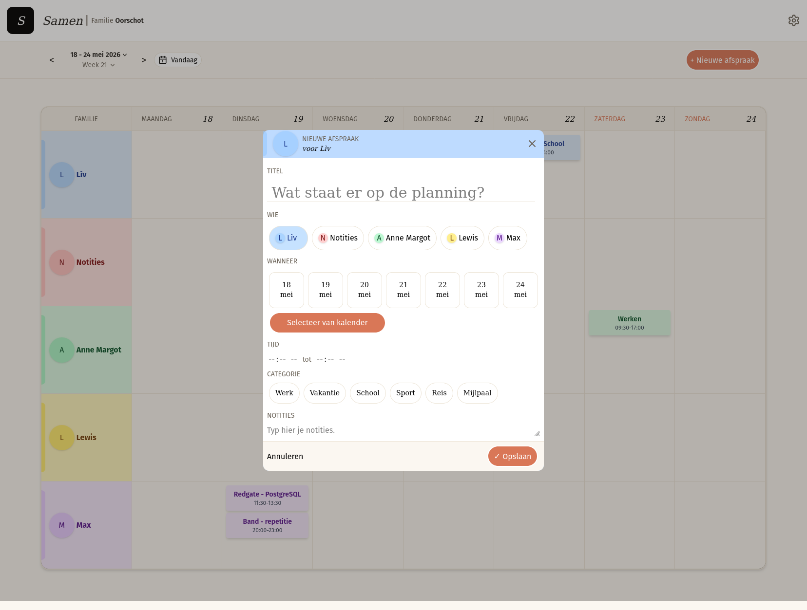
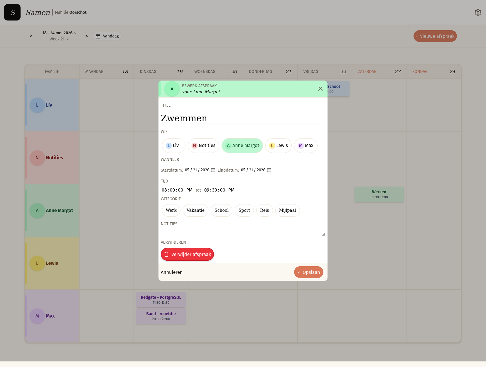

# Family Planner MVP

## What it is:

Family planner is a React application to manage the calendar of all your family members. It offers a unique way of presenting family appointments to the user displaying the weekly appointments of the family. The family members are presented on the Y axis, whilst the days of the week are presented on the X axis. This offers a similar overview of weekly family planners that are on paper.

## Screenshots:

## Current features

This application is still in development, hence the scope of features is limited to a MVP scope, therefore the bare minimum in terms of features are present at the moment:

- Login page; only existing users can login.
- Header; the header contains a **settings icon**, the settings icon is currently used as a **logout button**.
- Appointments overview; The appointments overview is fully functional clicking on an appointment will make you edit the appointment.
- Create new appointment, new appointment is fully functional.
- Edit appointment, editing an appointment can be done by clicking on an appointment in the weekly overview.
- Once the edit screen has opened you can also remove an appointment entirely.

## Technologies used:

- Vite
- React
- Typescript
- Tailwind CSS
- Supabase
- Date-fns

## Setup instructions:

- Create a free Supabase account at [Supabase](https://supabase.com).
- In the Supabase dashboard run the SQL queries that are in the backend folder.
- Update .env.example with your Supabase credentials.
- Use `npm run dev` for a quick server to explore the application or use `docker buildx build` to build the container and run it in Docker.

## Future features:

- Authentication flow for new users with onboarding.
- Settings menu for setting colors per user and display order for family members.
- Include family_id in the persons table on the backend.
- Adding alternative views: daily view and agenda list view.
- Adding the option to create an appointment for all family members.
- Adding the option to create an appointment that lasts the whole day.
- Adding logic for appointments that last multiple days.
- Create ability to import and export .ics files.

## Author

**Maximiliaan Oorschot** [LinkedIn] (www.linkedin.com/in/maxoorschot/)

Built as part of my transition from finance to software development.

